# TinyEngine 2.10 发布：零代码 CRUD、云端协作，开发效率再升级！

## 前言

TinyEngine 是一款面向未来的低代码引擎底座，致力于为开发者提供高度可定制的技术基础设施——不仅支持可视化页面搭建等核心能力，更可通过 CLI 工程化方式实现深度二次开发，帮助团队快速构建专属的低代码平台。

无论是资源编排、服务端渲染、模型驱动应用，还是移动端、大屏端、复杂页面编排场景，TinyEngine 都能灵活适配，成为你构建低代码体系的坚实基石。

最近我们正式发布 **TinyEngine v2.10 版本**，带来多项功能升级与体验优化：**模型驱动、登录鉴权、应用中心**等全新特性，同时还有Schema面板与画布节点同步、出码源码即时预览、支持添加自定义 MCP 服务器等功能进行了增强，以让开发协作、页面搭建变得更简单、更高效。

- 开源地址：[https://github.com/opentiny/tiny-engine](https://github.com/opentiny/tiny-engine)（欢迎 Star ⭐）
- 官方网站：[https://opentiny.design/tiny-engine](https://opentiny.design/tiny-engine)


## 版本特性总览


### 核心特性

- 模型驱动：零代码创建 CRUD
- 多租户与登录鉴权能力
- 新增应用中心与模板中心


### 功能增强

- 出码支持即时查看代码
- 自定义 MCP 服务器，扩展 AI 助手能力
- 画布与 Schema 面板支持同步滚动
- 页面 Schema CSS 字段格式优化
- 图表物料更新，组件属性配置平铺优化
- 多项细节优化与 Bug 修复


### 体验升级

- 新官网：UI 全面焕新
- 新文档：域名迁移与样式升级
- 新演练场：真实前后端，完整功能体验


## 新特性详解

### 1. 【核心特性】模型驱动：零代码极速创建CRUD页面（体验版本）

#### 背景与问题

在传统的后台管理系统开发中，创建一个包含表单、表格和完整 CRUD(增删改查) 功能的页面往往需要开发者：

- 重复配置相似的表单和表格组件
- 手动绑定数据源、编写事件处理逻辑
- 数据模型变更时，同步修改多个组件配置

这种重复性劳动不仅耗时，还容易出错。

#### 核心功能

**模型驱动特性**通过声明式的数据模型配置，自动生成对应的 UI 组件和数据交互逻辑，实现真正的"零代码"生成数据管理页面。

**核心模块**：

| 模块 | 功能 |
|------|------|
| 模型管理器插件 | 可视化创建数据模型、配置字段和 API，管理模型 |
| 内置模型组件 | 表单、表格、组合表单+表格，基于模型自动生成表单、表格，或组合生成完整 CRUD 页面 |
| 模型绑定配置器组件 | 为模型生成 UI、绑定 CRUD 逻辑 |

**支持的模型字段类型**：String（字符串）、Number（数字）、Boolean（布尔）、Date（日期）、Enum（枚举）、ModelRef（关联模型）

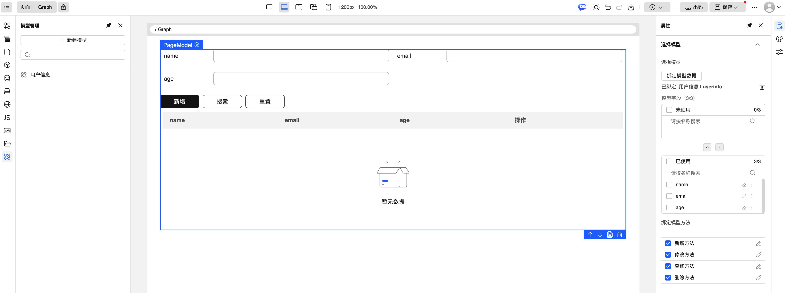

#### 价值亮点

- **开发效率大幅提升**：通过配置模型即可生成完整的 CRUD 页面，无需手动配置每个组件
- **后端自动生成**：使用默认接口路径时，自动生成数据库表结构和 CRUD 接口
- **UI 与接口自动绑定**：拖拽组件选择模型后，UI 自动生成，接口自动绑定，一站式完成前后端搭建
- **支持嵌套模型**：字段可关联其他模型，实现复杂数据结构（如用户关联部门）（后续实现）
- **标准化输出**：基于统一模型生成的 UI 组件保证了一致性
- **灵活扩展**：可自定义字段类型和组件映射

#### 使用场景

- 后台管理系统的数据管理页面
- 需要频繁进行增删改查操作的业务场景
- 需要快速原型的项目

#### 快速上手

**1. 创建数据模型**

打开**模型管理器**插件，创建数据模型（如"用户信息"）：
- 配置模型基本信息：中文名称、英文名称、描述
- 添加模型字段（如姓名、年龄、邮箱等）
- 配置字段类型、默认值、是否必填等属性

**2. 配置接口路径（可选）**

创建模型时，可以选择：
- **使用默认路径**：系统自动使用后端模型接口作为基础路径，并在后端自动生成对应的 SQL 表结构和 CRUD 接口
- **自定义路径**：指定自己的接口基础路径，对接已有后端服务

**3. 拖拽模型组件到页面**

在物料面板中选择模型组件拖拽到画布：
- **表格模型**：生成数据列表
- **表单模型**：生成数据录入表单
- **页面模型**：生成包含搜索、表格、编辑弹窗的完整 CRUD 页面

**4. 绑定模型，自动生成**

选中组件后，在右侧属性面板：
1. 点击"绑定模型数据"，选择刚才创建的模型
2. 系统自动生成 UI 界面
3. 系统自动绑定 CRUD 接口
4. 一站式完成前后端搭建

**5. 预览页面**

预览即可看到包含搜索、新增、编辑、删除、分页功能的完整数据管理页面。

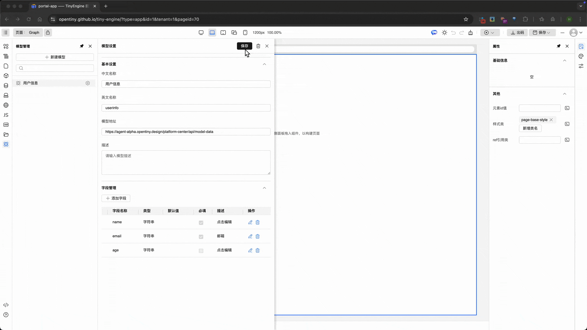


#### 核心流程图

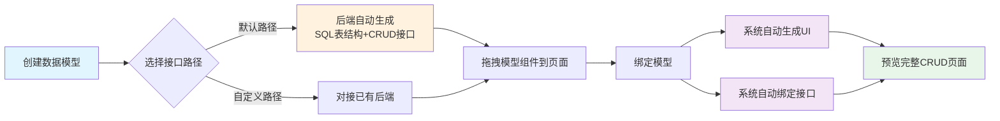

#### 用户只需关注

定义好**数据模型**，前后端自动生成：
- ✅ 无需手动编写表单 HTML
- ✅ 无需手动编写表格渲染逻辑
- ✅ 无需手动编写 API 调用代码
- ✅ 无需手动编写数据验证规则
- ✅ 无需手动编写分页排序逻辑

**让用户专注于业务逻辑和模型设计，而非重复的 UI 代码编写。**


### 2. 【核心特性】多租户与登录鉴权能力

#### 功能概述

TinyEngine v2.10 引入了完整的用户认证系统，支持用户登录、注册、密码找回，并结合多租户体系，让您的设计作品可以实现云端保存、多设备同步和团队协作。

#### 登录注册

- **用户登录**：基于用户名/密码的身份认证，Token 自动管理
- **用户注册**：支持新用户注册，注册成功后提供**账户恢复码**用于找回密码
- **密码找回**：通过账户恢复码重置密码，无需邮件验证

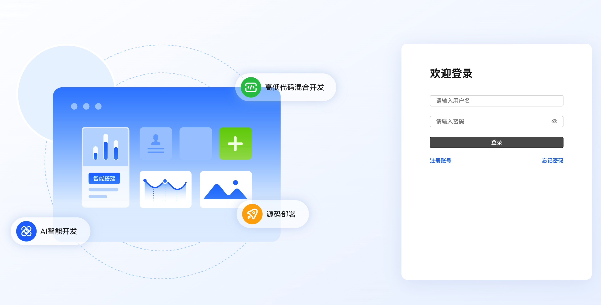

#### 组织管理

- **多组织支持**：用户可属于多个组织，灵活切换不同工作空间
- **组织切换**：动态切换组织上下文，组织间数据隔离
- **创建组织**：一键创建新组织，邀请团队成员加入

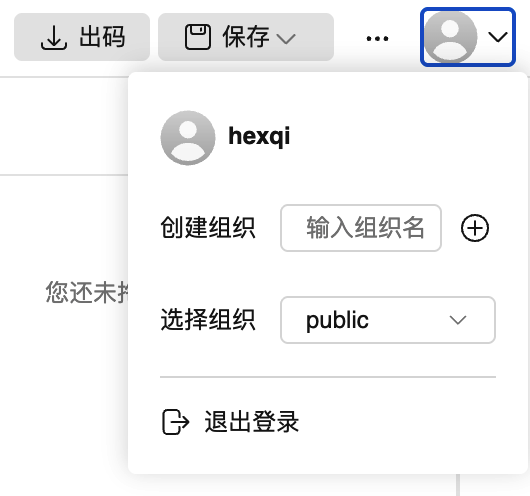

#### 登录鉴权流程

系统采用 Token 认证机制，通过 HTTP 拦截器实现统一的请求处理和权限验证：

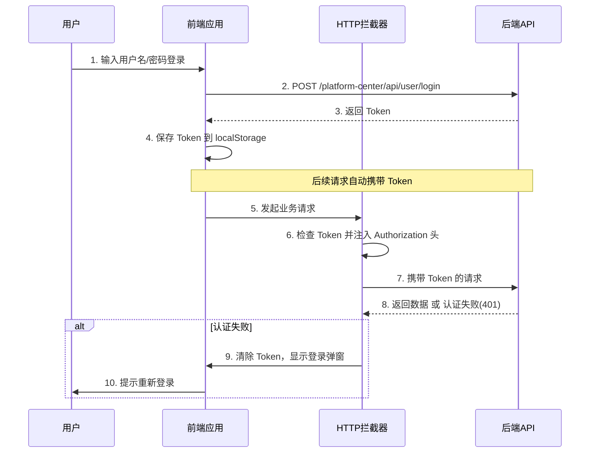

#### 访问入口

**登录界面**：访问 TinyEngine 时系统会自动弹出登录窗口，未登录用户需完成登录或注册。

**组织切换**：登录后可通过以下方式切换组织：
- 点击顶部工具栏的用户头像，选择「切换组织」
- 在用户菜单中直接选择目标组织

**退出/重新登录**：已登录用户可以点击右上角头像在菜单点击"退出登录"，进入登录页面重新登录

#### 使用场景

**个人使用**：登录后即可享受云端保存、多设备同步等功能，设计作品永不丢失。

**团队协作**：
- **创建组织**：为团队或项目创建独立组织空间
- **数据隔离**：不同组织的资源完全隔离，清晰区分个人与团队项目

> 💡 **提示**：新注册用户默认属于 **public** 公共组织，所有数据公共可见，您也可以创建自定义组织隔离数据。

#### 开发者指南

**环境配置**：
- **开发环境**：通过 `pnpm dev:withAuth` 命令启用登录认证，`pnpm dev` 默认不启用（mock server）
- **生产环境**：自动启用完整登录认证系统

也可以修改配置文件来启动或关闭登录鉴权：
```js
export default {
  // enableLogin: true // 打开或关闭登录认证
}
```

**多租户机制**：
- 用户可属于多个组织，通过 URL 参数标识当前组织上下文
- 组织间数据完全隔离，切换组织可查看不同资源
- 当 URL 未携带应用 ID 或组织 ID 时，系统自动跳转到应用中心


### 3. 【核心特性】应用中心与模板中心

应用中心和模板中心是此次版本新增的两大核心功能模块。通过应用中心可以集中管理您创建的所有低代码应用，为不同的场景创建不同的应用；模板中心则让优秀页面设计得以沉淀为可复用资产，团队成员可以基于模板快速搭建新页面，大幅提升协作效率。

#### 应用中心

登录后进入**应用中心**，集中管理您创建的所有低代码应用。

**功能亮点**：
- **统一管理**：在一个界面查看、创建、打开所有应用
- **快速切换**：无需手动输入 URL，一键进入任意应用编辑器
- **组织隔离**：不同组织的应用数据隔离，清晰区分个人与团队项目

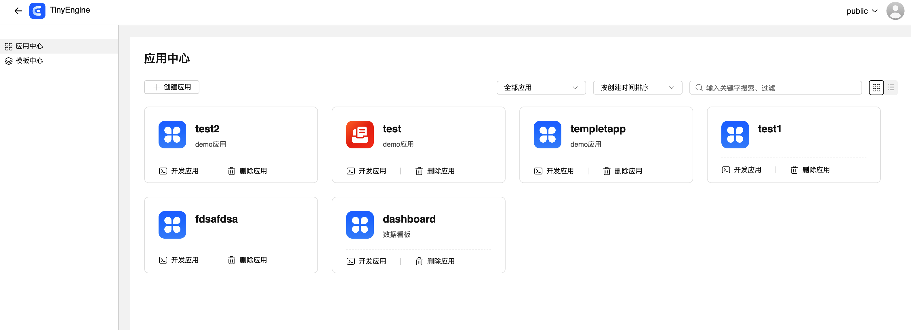

#### 模板中心

**模板中心**让页面设计资产得以沉淀和复用，提升团队协作效率。

**核心价值**：
- **设计复用**：保存优秀页面设计为模板，避免重复造轮子
- **快速启动**：基于模板创建新页面，继承已有布局和样式
- **团队共享**：组织内共享设计资产，统一 UI 风格和设计规范

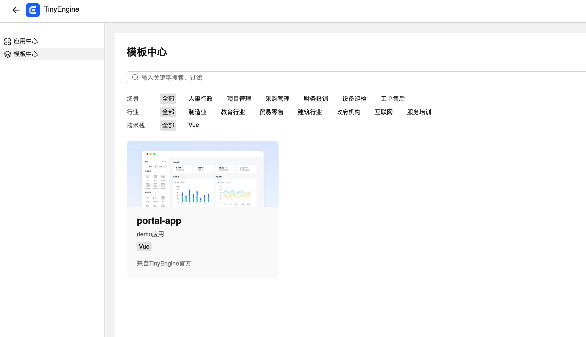

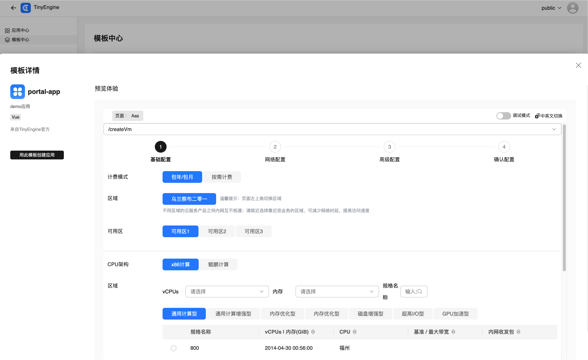

#### 访问入口

在编辑器中点击左上角菜单按钮，悬停即可看到**应用中心**和**模板中心**入口，点击即可前往。

#### 使用说明

**自动跳转规则**：
- 如果访问编辑器时未携带应用 ID 或组织 ID 参数，系统会自动跳转到应用中心
- 您可以在应用中心创建新应用，或打开已有应用进入编辑器

**组织权限说明**：
- **public 组织**：默认公共组织，所有用户的应用对所有人可见
- **自定义组织**：用户新建的组织默认仅创建者可见，需手动邀请成员加入
- 切换组织可以查看不同组织下的应用和资源

#### 特性开关

如果不需要使用应用中心与模板中心，可以在注册表中进行关闭:
```js
// registry.js
export default {
  [META_APP.AppCenter]: false, // 关闭应用中心
  [META_APP.TemplateCenter]: false // 关闭模板中心
  // ...
}
```


### 4. 【增强】出码即时预览 - 导出前预览所见即所得

出码功能新增**源码预览**能力，用户在导出代码前可以实时查看生成的源码内容，提升代码导出体验和准确性。

#### 功能特性

- **左右分栏布局**：左侧树形文件列表，右侧 Monaco 代码编辑器预览
- **智能初始化**：打开对话框时自动显示当前编辑页面对应的文件代码
- **实时预览**：点击树形列表中的任意文件，即可在右侧预览其代码内容
- **灵活选择**：支持勾选需要导出的文件

#### 使用方法

1. 在编辑器中点击「出码」按钮
2. 打开的弹窗中左侧树形列表显示所有可生成的文件，当前页面对应文件自动展示在右侧
3. 点击任意文件预览源码，勾选需要导出的文件
4. 点击「确定」选择保存目录完成导出

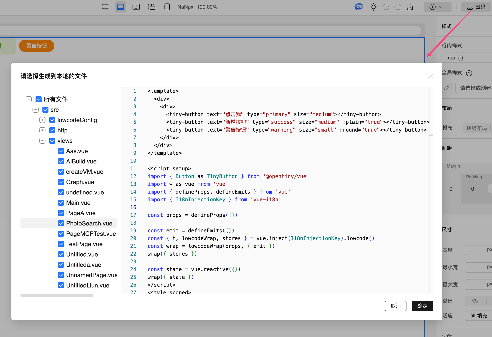


### 5. 【增强】自定义 MCP 服务器 - 扩展 AI 助手能力

之前版本中，TinyEngine已经提供内置MCP 服务，可以通过MCP工具让AI调用平台提供的各种能力。 本次特性是在TinyEngine 中支持添加自定义 MCP (Model Context Protocol) 服务器，可以通过配置轻松集成第三方 MCP 服务，扩展 AI 开发助手的工具能力。


#### 功能特性

- **灵活配置**：通过注册表简单的配置即可添加自定义服务器
- **协议支持**：支持 SSE 和 StreamableHttp 两种传输协议
- **服务管理**：在 AI 插件的配置界面即可管理 MCP 服务器的开关状态
- **工具控制**：可查看并切换各个工具的启用状态


#### 使用步骤

1. 准备您的 MCP 服务器（需符合 [MCP 协议规范](https://modelcontextprotocol.io/)）

2. 在项目的 `registry.js` 中添加配置

  ```js
  // 使用示例
  // registry.js
  export default {
    [META_APP.Robot]: {
      options: {
        mcpConfig: {
          mcpServers: {
            'my-custom-server': {
              type: 'SSE',              // 支持 'SSE' 或 'StreamableHttp'
              url: 'https://your-server.com/sse',
              name: '我的自定义服务器',
              description: '提供xxx功能的工具',
              icon: 'https://your-icon.png'  // 可选
            }
          }
        }
      }
    }
  }
  ```

3. 刷新编辑器，在 AI 插件 MCP 管理面板中即可看到新添加的服务器


4. 启用服务器，选择需要的工具，即可在 AI 助手中开始使用！


#### 场景示例

您可以集成企业内部 MCP 服务、社区 MCP 服务、第三方 MCP 工具等，扩展 AI 助手的业务能力。

例如，下面是一个添加图片搜索MCP服务后使用AI生成带图片页面的场景示例：


### 6. 【增强】画布与 Schema 面板支持同步滚动

Schema 面板新增**"跟随画布"**功能，启用后当在画布中选中组件时，Schema 面板会自动滚动到选中组件的对应位置并高亮显示。

#### 使用场景
- **快速定位**：当页面元素较多时，能快速找到对应组件的 Schema 配置
- **双向对照**：可视化视图与 JSON 代码视图对照，便于理解页面结构

#### 使用方法
打开 Schema 面板，勾选面板标题栏的"跟随画布"复选框启用。在画布中点击切换元素，即可看到 Schema 面板跟随变化。

效果如下：
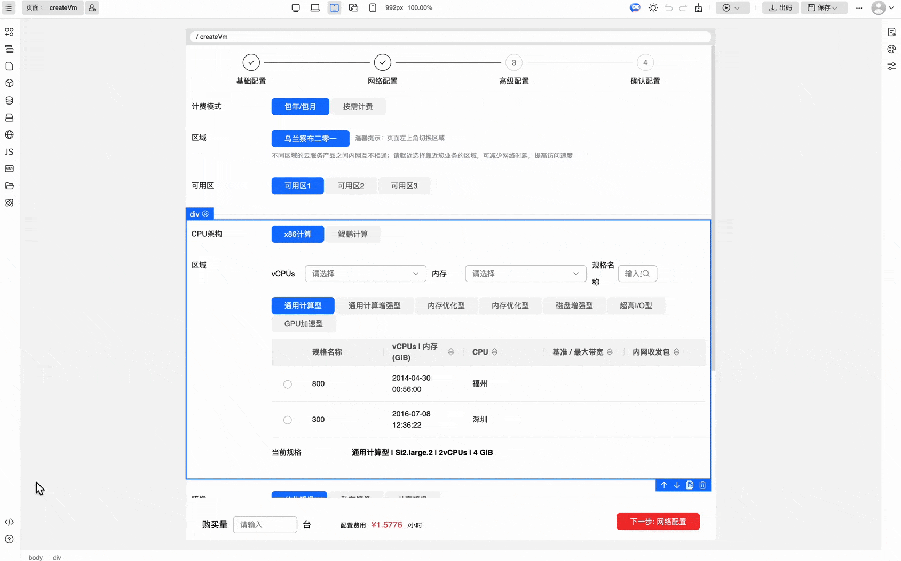

### 7. 【优化】页面 Schema CSS 字段格式优化

页面 Schema 中的 CSS 样式字段由字符串格式优化为**对象格式**，提升样式配置的可读性和可维护性。系统会自动处理对象与字符串的相互转换，出码时自动转换为标准 CSS 字符串格式，同时完美兼容之前的字符串格式。

#### 优化场景
- **AI场景更友好**：AI生成代码及修改样式场景，能够更快速地进行增量生成及修改
- **编辑更直观**：对象格式支持属性智能提示和语法高亮，编辑体验更佳
- **阅读更清晰**：结构化的对象格式易于查看和修改样式属性
- **维护更便捷**：新增或修改样式规则时，无需手动拼接 CSS 字符串

#### 格式对比

**之前（字符串格式）**：
```json
"css": ".page-base-style { padding: 24px; background: #FFFFFF; } .block-base-style { margin: 16px; } .component-base-style { margin: 8px; }"
```

**现在（对象格式）**：
```json
"css": {
  ".page-base-style": {
    "padding": "24px",
    "background": "#FFFFFF"
  },
  ".block-base-style": {
    "margin": "16px"
  },
  ".component-base-style": {
    "margin": "8px"
  }
}
```

#### 兼容性说明
- 两种格式完全兼容，可在同一项目中混用
- 系统自动识别格式类型并进行转换
- 出码时统一转换为标准 CSS 字符串格式
- 页面样式设置等场景使用都与之前保持一致，不受该特性影响


### 8. 【增强】图表物料更新，组件属性优化

图表物料进行了如下优化：
- 添加三种常用图表组件物料：仪表盘、拓扑图、进度图
- 图表组件的配置面板优化，将原有的图标配置属性由整体 options 配置拆分为独立的属性配置项（颜色、数据、坐标轴等），使配置更加清晰直观。

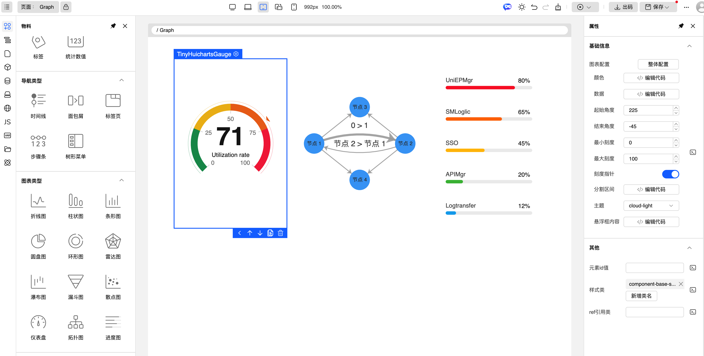


### 9. 【新体验】新演练场 - 完整的前后端体验

演练场进行了全面升级，从原来的前端 Mock 数据改为完整的前后端部署，带来真实的体验环境。

**升级亮点**：

- **完整的前后端部署**：不再是拦截接口 Mock 数据，而是真实的服务端环境
- **支持用户登录**：可以使用真实账户登录演练场
- **数据隔离**：用户数据基于租户进行共享或隔离，更符合实际使用场景
- **功能完整体验**：之前无法体验的功能现在都可以正常使用，如AI助手插件自然语言生成页面

**新演练场地址**：[https://playground.opentiny.design/tiny-engine/](https://playground.opentiny.design/tiny-engine/)

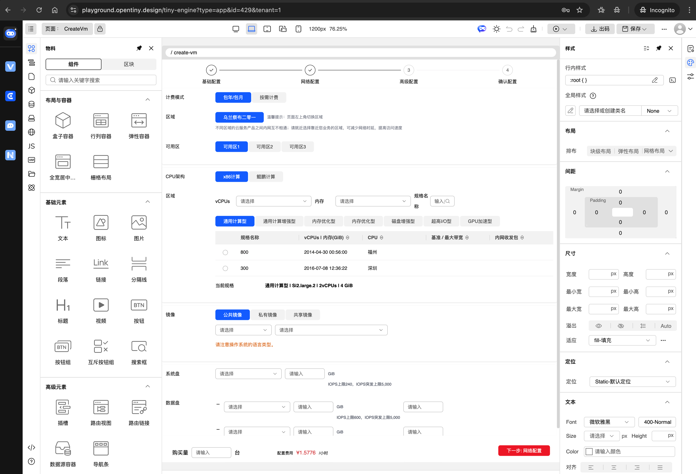

通过下面两个入口都可以访问：
- 官网[https://opentiny.design/tiny-engine/](https://opentiny.design/tiny-engine/)点击 "立即体验" 自动跳转新版演练场
- 演练场首页[https://playground.opentiny.design/](https://playground.opentiny.design/)点击 "TinyEngine > 进入演练场" 前往

如您希望继续使用旧版演练场，依旧可以通过下面地址继续访问：
旧版演练场：[https://opentiny.design/tiny-engine#/tiny-engine-editor](https://opentiny.design/tiny-engine#/tiny-engine-editor)


### 10. 【新体验】新官网 - UI 全面焕新

TinyEngine 官网首页 UI 全面焕新，带来更现代、更清爽的视觉体验。

- **全新设计**：首页内容刷新，并采用现代化的设计语言，视觉更加清爽美观
- **响应式布局**：完美适配各种屏幕尺寸，移动端访问更友好

访问新版官网：[https://opentiny.design/tiny-engine](https://opentiny.design/tiny-engine)

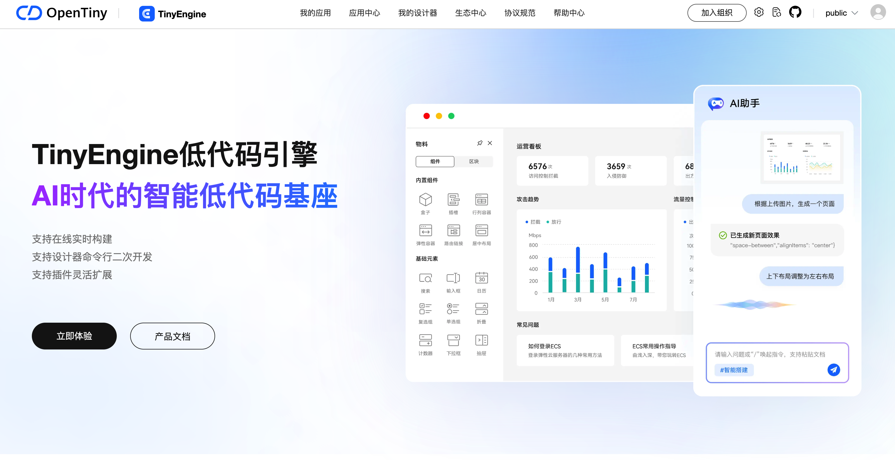


### 11.【新体验】新文档 - 全新文档体验

TinyEngine 文档与其他OpenTiny产品文档统一迁移至新docs子域名：

**新域名**：[https://docs.opentiny.design/tiny-engine/](https://docs.opentiny.design/tiny-engine/)

文档变化：

- 整体更统一，方便查找切换其他文档
- 同时也进行了全面的样式优化，阅读体验更佳

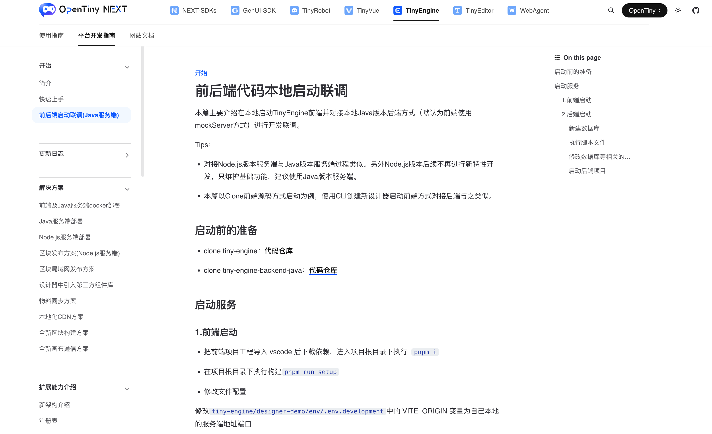


### 12. 【其他】功能细节优化&bug修复

* [修复物料baseUrl问题](https://github.com/opentiny/tiny-engine/pull/1741) by @hexqi  
* [移除me接口冗余请求头](https://github.com/opentiny/tiny-engine/pull/1739) by @xuanlid  
* [登录页响应式优化](https://github.com/opentiny/tiny-engine/pull/1742) by @lichunn  
* [修复本地开发代理问题](https://github.com/opentiny/tiny-engine/pull/1744) by @hexqi  
* [修复工具调用参数问题](https://github.com/opentiny/tiny-engine/pull/1747) by @hexqi  
* [优化应用窗口打开方式](https://github.com/opentiny/tiny-engine/pull/1753) by @xuanlid  
* [区块/页面管理预览修复](https://github.com/opentiny/tiny-engine/pull/1754) by @xuanlid  
* [代码检查优化](https://github.com/opentiny/tiny-engine/pull/1757) by @hexqi  
* [重定向文档地址更新](https://github.com/opentiny/tiny-engine/pull/1758) by @xuanlid  
* [图表属性默认值支持](https://github.com/opentiny/tiny-engine/pull/1760) by @xuanlid  
* [文档样式优化](https://github.com/opentiny/tiny-engine/pull/1765) by @xuanlid  
* [AI助手对话相关问题修复](https://github.com/opentiny/tiny-engine/pull/1770) by @hexqi  
* [应用ID传参修复](https://github.com/opentiny/tiny-engine/pull/1771) by @lichunn  
* 文档更新
  * [修改物料同步方案文档](https://github.com/opentiny/tiny-engine/pull/1682) by @lu-yg  
  * [过期文档问题处理](https://github.com/opentiny/tiny-engine/pull/1704) by @xuanlid  
  * [新增应用预览/资源管理文档](https://github.com/opentiny/tiny-engine/pull/1687) by @betterdancing 


## 结语

回首这一年，TinyEngine 在开源社区的成长离不开每一位开发者和贡献者的支持。v2.10 版本作为春节前的最后一次发布，我们为大家带来了多项重磅特性：

| 特性 | 核心价值 |
|------|---------|
| 模型驱动 | 零代码 CRUD，开发效率跃升 |
| 多租户与登录鉴权 | 云端协作、团队协作 |
| 应用中心与模板中心 | 应用管理、资产沉淀 |
| 出码预览 | 导出前预览，提升代码导出体验 |
| 自定义 MCP | 扩展 AI 能力，集成企业服务 |
| Schema 面板同步滚动 | 画布与代码视图联动 |
| CSS 字段格式优化 | 对象格式，可读性更强 |
| 图表物料更新 | 配置平铺，更直观 |
| 新演练场 | 真实前后端，完整体验 |
| 新官网/文档 | UI 焕新，体验升级 |


**致谢**

本次版本的开发和问题修复诚挚感谢各位贡献者的积极参与！

同时邀请大家加入开源社区的建设，让 TinyEngine 在新的一年里成长得更加优秀和茁壮！

**新春祝福**

值此新春佳节即将到来之际，TinyEngine 团队衷心祝愿大家：

🧧 **新年快乐，万事如意！** 🧧

愿新的一年里：
- 代码如诗行云流水
- 项目如期顺利上线
- Bug 远离，需求清晰
- 团队协作高效顺畅
- 事业蒸蒸日上，生活幸福美满！

🎊 **春节快乐，阖家幸福！** 🎊

让我们在春节后带着满满的热情和能量，继续在未来道路上探索前行！

